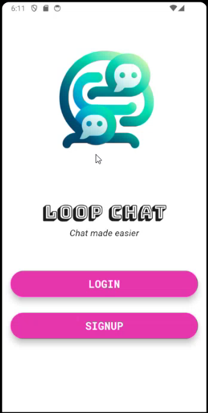
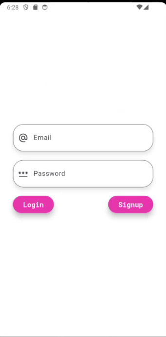

# Realtime Chat Application with Flutter and Firebase

This is a realtime chat application built using Flutter and Firebase. It allows users to chat with each other in real-time, making use of Firebase's powerful real-time database capabilities.

## Features

- **Real-time Messaging**: Chat messages are delivered instantly using Firebase's real-time database.
- **User Authentication**: Users can sign up, log in, and securely authenticate using Firebase Authentication.
- **User Profiles**: Users can set up their profiles with avatars and other personal information.
- **Online Status**: Users can see the online status of other users.
- **Push Notifications**: Push notifications are sent to users to notify them of new messages even when the app is in the background.
- **Responsive UI**: The UI is built using Flutter, ensuring a smooth and responsive experience across different devices.

## Technologies Used

- **Flutter**: A cross-platform framework for building mobile applications.
- **Firebase Realtime Database**: A cloud-hosted NoSQL database that lets you store and sync data between your users in real-time.
- **Firebase Authentication**: A service that can authenticate users using only client-side code.
- **Firebase Cloud Messaging**: A cross-platform messaging solution that lets you reliably send messages at no cost.

## Getting Started

To get started with this project, follow these steps:

1. Clone this repository.
2. Set up a Firebase project and configure it for Android and iOS.
3. Update the Firebase configuration files in the project.
4. Run the app on your device or emulator.

For detailed instructions on setting up Firebase with Flutter, refer to the [official documentation](https://firebase.flutter.dev/docs/overview).

## Screenshots

## Contributing

Contributions are welcome! Feel free to open an issue or submit a pull request.

## License

This project is licensed under the MIT License - see the [LICENSE](LICENSE) file for details.
